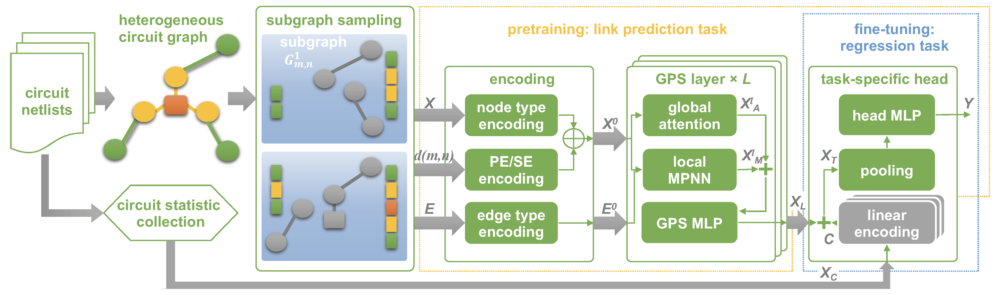

# CirGPS_simple
## Few-shot Learning on AMS Circuits and Its Application to Parasitic Capacitance Prediction
Note: 
* This is a simple version of CirGPS.
* Dataset can be found at [Google Drive](https://drive.google.com/drive/folders/1sBQEXEFYQzav43KghIh1pybnusiJLotS?usp=drive_link)


Graph representation learning is a powerful method to extract features from graph-structured data, such as analog/mixed-signal (AMS) circuits. However, training deep learning models for AMS designs is severely limited by the scarcity of integrated circuit design data. 
This is the repository of CirGPS, a few-shot learning method for parasitic effect prediction in AMS circuits.

The proposed method contains five steps: 
1. AMS netlist conversion, 
2. enclosing subgraph extraction, 
3. position encoding, 
4. model pre-training/fine-tuning. 

CirGPS is built on the top of [GraphGPS](https://github.com/rampasek/GraphGPS.git), which is
using [PyG](https://www.pyg.org/) and [GraphGym from PyG2](https://pytorch-geometric.readthedocs.io/en/2.0.0/notes/graphgym.html).
Specifically *PyG v2.2* is required.
To use all features backed up by GraphGPS, please go to another [repository](https://github.com/ShenShan123/CirGPS.git).

## Instructions

### Python environment setup with Conda
In this simple version of cirgps, we employed `LinkNeighborLoader`, please see the [pyg doc](https://pytorch-geometric.readthedocs.io/en/2.5.1/modules/loader.html#torch_geometric.loader.LinkNeighborLoader) for more details.
These codes are tested on our platform with 
- torch==2.2.0+cu118
- torch-cluster==1.6.3
- torch-geometric==2.6.1
- torch-scatter==2.1.2
- torch-sparse==0.6.18
- torch-spline-conv==1.2.2

### Create and activate a conda environment
```bash
conda create -n yourname python=3.10
conda activate yourname
```
### Install dependencies
```
pip install -r requirements.txt
```

## 🚀 Usage

### Dataset Preparation

#### Dataset Download Instructions

The datasets used for training and testing CircuitGCL are available for download via the following links. You can use `curl` to directly download these files from the provided URLs.

##### List of Datasets

| Dataset Name    | Description                          | Download Link                                                                              |
| --------------- | ------------------------------------ | ------------------------------------------------------------------------------------------ |
| SSRAM           | Static Random Access Memory dataset  | [Download](https://circuitgcl-sram.s3.ap-southeast-2.amazonaws.com/raw/ssram.pt)           |
| DIGITAL_CLK_GEN | Digital Clock Generator dataset      | [Download](https://circuitgcl-sram.s3.ap-southeast-2.amazonaws.com/raw/digtime.pt)         |
| TIMING_CTRL     | Timing Control dataset               | [Download](https://circuitgcl-sram.s3.ap-southeast-2.amazonaws.com/raw/timing_ctrl.pt)     |
| ARRAY_128_32    | Array with dimensions 128x32 dataset | [Download](https://circuitgcl-sram.s3.ap-southeast-2.amazonaws.com/raw/array_128_32_8t.pt) |
| ULTRA8T         | Ultra 8 Transistor dataset           | [Download](https://circuitgcl-sram.s3.ap-southeast-2.amazonaws.com/raw/ultra8t.pt)         |
| SANDWICH-RAM    | Sandwich RAM dataset                 | [Download](https://circuitgcl-sram.s3.ap-southeast-2.amazonaws.com/raw/sandwich.pt)        |
| SP8192W         | Specialized 8192 Width dataset       | [Download](https://circuitgcl-sram.s3.ap-southeast-2.amazonaws.com/raw/sp8192w.pt)         |

### Dataset path
After downloading the above dataset, please add its path into the dataset_dir='' field in the main.py function.
```bash

dataset_dir=''
```


### Running an experiment with CirGPS
run the `main.py` for training & evaluation

```bash
conda activate cirgps
```
To conduct training, type
```bash
# To use all arguments, see ArgumentParser in main.py
python main.py --dataset ssram+digtime --use_pe 0 --num_hops 1
```
